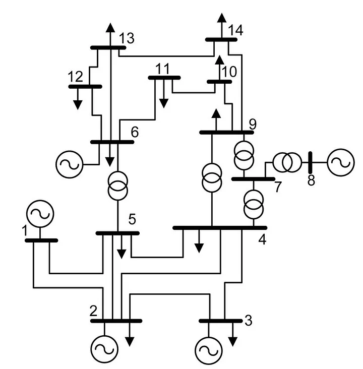
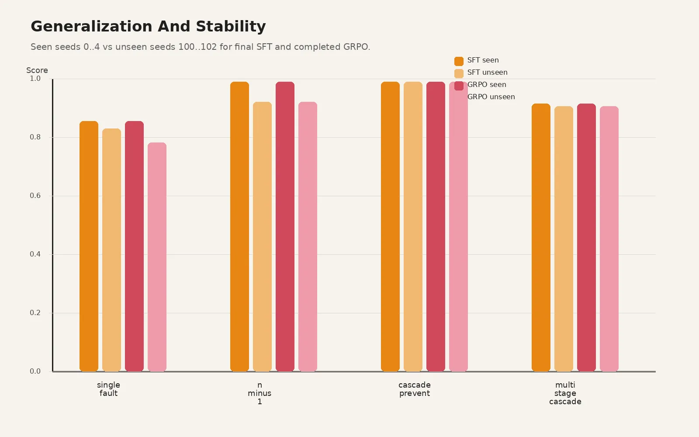
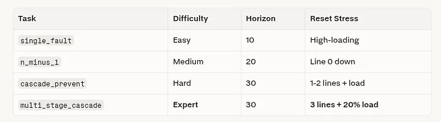
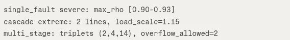
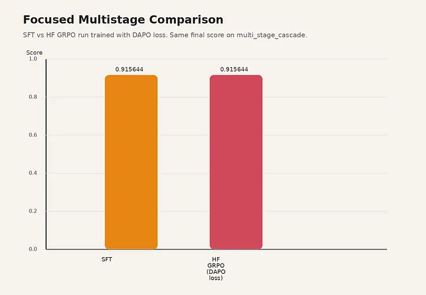
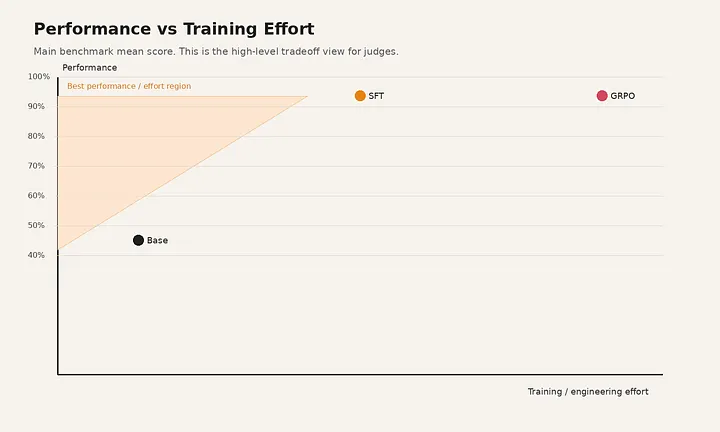
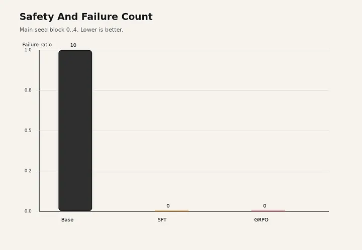
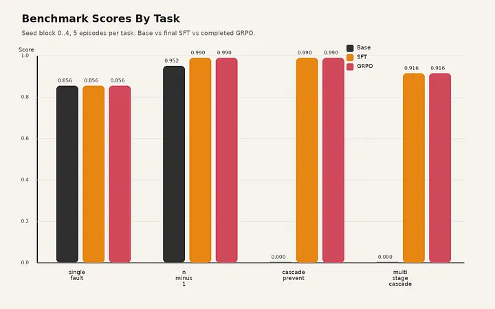

# OpenEnv: Grid2op Environment

## The Problem — A Grid Operator's Seconds Running Out

Imagine it's 2 AM on a hot summer night. A thunderstorm has knocked out a transmission line. The grid operator already handling three other contingencies has seconds to reroute power before overloads cascade into a blackout affecting millions.

This is the reality of modern power-grid control:

- One wrong action can trigger cascading failures
- Standard agents fail when scenarios change
- Reward-driven policies exploit shortcuts instead of ensuring safety

## **🎯 Goal:** Build an agent that handles real-world grid stress and generalizes beyond training.

## The Solution — A Two-Stage RL Framework over Grid2Op

**The evidence:**

- Standard RL agents trained with Supervised Fine-Tuning (SFT) on fixed task distributions tend to overfit those tasks and often fail to generalize to new scenarios introduced during a hackathon phase.
- In RL-evaluation benchmarks similar to OpenEnv, high-score trajectories have been found to reward-hack by exploiting loopholes in the scoring function instead of satisfying the underlying safety constraints of the power system.

We used a **Qwen/Qwen3–4B-Instruct-2507** model as the teacher to generate training data, and then performed **Supervised Fine-Tuning (SFT)** on a Qwen3-4B model using that synthetic data.

> **Why not a reasoning model?** In power grid control, time taken for an action is predominantly important and reasoning LLMs are time-consuming, so an Instruction (non-thinking) model is used here.

This follows a **teacher–student distillation** approach, where the smaller model learns from the outputs of the larger model. The fine-tuning pipeline focuses on producing safe and consistent dispatch and topology decisions through SFT, with additional reward-based optimization (**GRPO-style**) to improve decision quality and robustness.

---

## Dataset

**Grid2Op** is an open-source simulation framework built by RTE France. It is the official platform behind the **L2RPN (Learning to Run a Power Network)** competition series, run at NeurIPS 2020, WCCI 2022, and ICAPS 2021.
**Chronics** : Weekly time-series grid scenarios at 5-minute resolution
This dataset is built on the **IEEE 14 Bus power grid** — a standard benchmark from the IEEE test systems:



```
IEEE Case 14 — Modified by RTE France for l2rpn_case14_sandbox
━━━━━━━━━━━━━━━━━━━━━━━━━━━━━━━━━━━━━━━━━━━━━━━━━━━━━━━━━━━━━
  Substations  : 14
  Powerlines   : 20
  Generators   : 6   (mix of thermal and dispatch units)
  Load buses   : 11  (load_1_0, load_2_1, ..., load_13_10)
  Storage      : none in this configuration
  Timestep     : 5 minutes
  Steps/week   : 8,065 per scenario (~4.7 weeks)
```

---

## What It Does

### Stage 1: Data Curation & SFT — Teaching Diversity over Passivity

To ensure the AI learned physics rather than memorizing formats, we built a robust pipeline using a synthesized Teacher dataset, heavily modified before engaging Supervised Fine-Tuning (SFT):

**Synthesized Data Curation:**
We utilized a Teacher model to automatically propose candidates and simulate their outcomes, compiling a massive raw dataset of **5,215 episodes**. However, the raw data exposed a dangerous bias: the model overwhelmingly favored passive _do_nothing_ survival algorithms.

**Balancing the Baseline:**
We systematically intervened to force action diversity. For Task 1, we re-labeled the dataset to aggressively prioritize active interventions — clamping the final data distribution to a perfectly balanced **~60/40 split** (exactly 289 redispatch and 182 do_nothing actions).

**Eliminating Passivity in Complex Tasks:**
We mirrored this rigor across Tasks 2, 3, and 4. We applied strict numeric caps (e.g., locking cascade do_nothing rows to exactly 200, while artificially boosting `reconnect_line` and `disconnect_line` rows) to ensure the agent physically learned how to triage cascades instead of freezing up.

### Stage 2: Supervised Fine-Tuning (SFT)

Using our finalized, balanced dataset of **3,373 rows**, we trained the Qwen3-4B model using **QLoRA**. We isolated the loss gradient exclusively to the generated JSON output (`assistant_only_loss`) to prevent memory waste.

**Final Evaluation:** The results proved the pipeline's worth. Evaluating the SFT model revealed massive improvements in both performance scoring and action diversity — the model completely abandoned its initial "passive surviving" bias and confidently deployed active redispatching and topological cuts to save the grid.

---

## Tasks

The task ladder progresses from local overload correction → contingency operation → cascade prevention → multi-stage resilience planning.

### Task 1 (Easy): `single_fault`

**Purpose:** The grid is mostly healthy, but one line is moving close to its thermal limit. The agent gets a short 10-step window to act. This is the cleanest entry point: identify local stress, apply a safe corrective action, and restore margin.

- **Objective:** Bring all lines below the thermal threshold of `max_rho < 0.80`
- **Actions:** Limited to `redispatch` and `do_nothing` (topology cuts are explicitly banned)
- **Performance:** Final SFT result is **0.856** (seed block 0–4) and **0.830** (unseen seeds). The bottleneck is not policy quality, but rather that redispatch-candidate generators often fail to surface a threshold-clearing action for difficult seeds.

---

### Task 2 (Medium): `n-1`

**Purpose:** Tests post-contingency control rather than single-line repair. One line is already disconnected at reset, and the agent has to operate the degraded topology safely for **20 steps** without blacking out the grid. This is closer to classical N-1 security reasoning than Task 1, where the topology is still intact.

- **Objective:** Clear emergencies (`rho >= 0.92`) and maintain steady-state security (`rho < 0.90`)
- **Actions:** `redispatch`, `reconnect_line`, and `do_nothing`
- **Performance:** Final SFT result is **0.990** (seed block 0–4) and **0.922** (unseen seeds). The model moved from a passive do_nothing bias to an active policy using redispatch and reconnection.



> _Figure 2: Generalization and Stability_

Under this paradigm, the agent:

- Masters Tasks 2 and 4 (the "critical" tasks) without breaking the physics simulation
- Generalizes to unseen tasks that were not present in the original training set

---

### Task 3 (Hard): `cascade_prevent`

**Purpose:** The first explicitly time-critical cascade-control task in the benchmark. Two lines are disconnected and load is increased at reset. The agent must prevent additional overload-driven trips over a **30-step** horizon.

- **Objective:** Prioritize timestep overflow trip prevention over global margin improvement
- **Actions:** `redispatch`, `reconnect_line`, `disconnect_line`, and `do_nothing`
- **Performance:** Clear SFT win, achieving **0.990** on all seed blocks (compared to **0.000** for the base model). This task provides strong evidence that the SFT pipeline successfully learned the environment's specific safety protocols.

---

### Task 4 (Very Hard / Expert): `multi_stage_cascade`

**Purpose:** The hardest benchmark task. Three lines are disconnected, load is increased, and the task is designed around guaranteed multi-stage degradation rather than full prevention. The goal is to preserve as much load as possible across stage boundaries over **30 steps**.

- **Objective:** Stabilize across stage boundaries, maximize `available_load_ratio`, and prevent islanding without sufficient generation
- **Actions:** `redispatch`, `reconnect_line`, `disconnect_line`, and `do_nothing`
- **Performance:** Significant improvement over the base model (**0.915** vs **0.000** on seed block 0–4). It is stage-aware and penalizes load loss at boundary transitions rather than rewarding simple step-to-step survival.

---

## How It Was Built

### Environment Design

We built a physics simulation benchmark on Grid2Op's `l2rpn_case14_sandbox`, exposed through OpenEnv/FastAPI. Agents interact via modern API while real power flow comes from Grid2Op's solver underneath. Every action flows through:

```
verifier → simulator → live physics
```

**Core principle:** Server owns truth. Live Grid2Op executes final actions, candidates run `obs.simulate()` first, graph structure recomputes from live state, grading stays separate from training rewards. This kills prompt-only intelligence dead.

### 4-Layer Safety Stack

```
LLM proposes → VR filters → Physics validates → Grid2Op executes
```

| Layer       | Role                                             |
| ----------- | ------------------------------------------------ |
| **VR**      | Schema, line/gen IDs, task legality              |
| **RLVR**    | Rewards only after objective physics improvement |
| **Physics** | `obs.simulate()` catches convergence fails       |
| **Live**    | `env.step()` only for simulator-approved actions |

### Progressive Task Ladder





**Result:** LLMs that survive physics, not just talk about it. From hallucinated redispatch to 0.99 cascade prevention in 100 episodes.

---

### Physics-Based Simulation

Physics simulation runs through a tight dual pipeline: real actions execute via `env.step()` while candidates are pre-tested with `obs.simulate()`. Each simulation returns:

- `max_rho`
- `done` status
- `overloaded_line_ids`
- `convergence_failed` flags

Before physics even engages, actions get surgically sanitized:

- Invalid indices are stripped
- Redispatch clipped to generator bounds
- Empty actions fallback to `do_nothing`
- Any invalid non-noop attempt takes a **-0.1 penalty hit**

This creates an ironclad safety envelope where the model can explore freely, but zero hallucinations ever touch the live grid.

---

### Graph and Topology Intelligence

The environment exposes structural guidance computed from the live grid state, including:

- `bridge_lines`
- `safe_to_disconnect`
- `n_minus_1_critical_lines`
- High-centrality buses
- Congestion corridors
- Islanded clusters

**Why graph intelligence matters:**

- Prevents naive topology edits that accidentally island the grid
- Improves N-1 and cascade behavior by exposing structural bottlenecks, not just scalar overload
- Makes the policy contingency-aware and topology-aware, not purely reward-reactive

---

### Verification Pipeline

The environment operates as a control loop:

```
VR →→ RLVR →→ Physics Engine →→ LLM-Bound Action Verify
```

**Two reward layers:**

1. **Environment reward:** Official benchmark score based on survivability
2. **Training reward (GRPO):** Adds verifier-style checks (format, schema, match to verified candidate, safety, objective alignment, anti-hacking penalties)

**Controls against abuse/cheating:**

- Fixed horizons, task-specific legality
- Parser/schema validation
- Verified-candidate matching
- Simulator safety checks
- Log-based failure tracking

---

## GRPO (Group Relative Policy Optimization)

GRPO was added after SFT was already strong, to test whether verifier-guided offline RL could improve the policy without relaxing safety or verified-action constraints.

We ran multiple training runs (local compact runs, cloud HF-Jobs runs) and also tried multiple policy-update strategies (different reward-shaping, reward-clipping, and reward-hacking-style penalties) to push the model beyond the SFT baseline.

**In the final submission:**

- The SFT model (Qwen/Qwen3–4B-Instruct-2507) is the strongest evaluated agent
- GRPO is a flat but safe, safety-preserving research extension: it runs multiple times, tests reward-hacking-style tricks and policy-update variants, but does not break the SFT baseline and instead reproduces similar scores

### SFT vs GRPO

The multistage stress test shows a clear result: SFT and HF-GRPO (trained with DAPO loss) achieve the same final score, **0.915644** on `multi_stage_cascade`. This means GRPO preserves the strong multistage behavior learned by SFT, but in this run it does not deliver an additional score lift. In short, for the hardest stage-aware benchmark, **GRPO is performance-stable rather than performance-improving.**



---

## Scoring

The scoring function combines:

- **Episode-based reward** (e.g., cumulative score over time) that penalizes disconnections, line overloads, and voltage violations
- **Task-specific bonuses/penalties** (e.g., higher weight for Tasks 2 and 4) to reflect the "critical-task" importance

The final score is normalized or aggregated across multiple chronics (simulation runs) to avoid overfitting to a single scenario.



---

## Reward

The reward function acts as the per-step learning signal, shaping how the agent learns to operate the grid. It is carefully designed to be **task-specific**, aligning optimization with real operational goals.

| Task                      | Reward Formula Highlights                                                                                                                                                                                           |
| ------------------------- | ------------------------------------------------------------------------------------------------------------------------------------------------------------------------------------------------------------------- |
| **`single_fault`**        | `+0.05*(1-max_rho)`, `-0.2*overloaded_count`, early success `+1/step`, timeout miss `-5.0`                                                                                                                          |
| **`n_minus_1`**           | `0.3*r_survive + 0.6*r_overload + 0.1*r_cost`, reconnect bonus `+2.0`, terminal survival bonus `+10.0*(progress²)`, early termination `-15.0`                                                                       |
| **`cascade_prevent`**     | No-trip `+0.3`, auto-trip `-2.5`, overflow penalty `-0.05*sum(overflow²)`, thermal margin `+0.1*margin`, convergence/blackout `-12.0`, terminal containment bonus (up to `+5.0`)                                    |
| **`multi_stage_cascade`** | Generation cost `-0.02*(gen/load)`, island convergence `+0.5*available_island_ratio`, boundary load-loss `-5.0*(1-available_load_ratio)`, convergence/blackout `-12.0`, terminal win `+8.0*(available_load_ratio²)` |

**Most important fixes:**

- Keep benchmark score separate from training reward; use task-specific graders as ground truth
- Add task-specific graders and objective-aware prompts that explicitly state the real goal (e.g., `max_rho < 0.80`, reconnection, load preservation)
- Shape rewards to penalize delays and partial fixes (e.g., overflow countdowns, load loss at stage boundaries)
- Enforce verified-candidate action selection so the model cannot invent unsafe "clever" actions
- Test on unseen seeds; true improvement must generalize beyond the dev-seed block



---

## Benchmark

Benchmarking is structured as a controlled experiment where the same policy is tested under:

- Fixed stress tiers
- Fixed reset rules
- Deterministic grading

When switching to benchmark mode, each task is pinned to predefined scenario tiers:

| Task                  | Benchmark Tiers                                                       |
| --------------------- | --------------------------------------------------------------------- |
| `single_fault`        | Easy, moderate, and severe loading bands                              |
| `cascade_prevent`     | Progressively stronger outage-and-load combinations (easy to extreme) |
| `multi_stage_cascade` | Expert setting with severe initial faults and stage-aware pressure    |

The evaluation loop is equally strict. For every task-tier-seed combination, the runner resets the environment, executes the control policy step-by-step, and sends the full episode log to the grader. The grader then computes a **bounded deterministic score** from operational outcomes, not from prompt style or intermediate verbosity.



Benchmarking is kept separate from training reward. Reward helps the agent learn during interaction, but benchmark score reflects whether the policy actually contained overloads, handled contingencies, and preserved survivability under real simulator dynamics.

---

## Data Sources

The agent is trained on:

- **Grid2Op IEEE 14 BUS** — an open-source RL-ready power-grid simulator developed by RTE France and backed by the L2RPN competition series (NeurIPS 2020, ICAPS 2021, WCCI 2022)
- **1,014 scenarios** from **ChroniX2Grid**, which generates spatiotemporally correlated load and generation profiles that mimic real-world French-grid statistics
- Each scenario contains full time-series data for load and generator active/reactive power, plus 5-minute-ahead forecasts, over **8,065 timesteps (~4.7 weeks)**, enabling long-horizon and seasonal-pattern RL episodes
- ChroniX2Grid's correlated-noise models produce diverse scenarios: some with high peak-to-mean ratios (spiky load), others with high ramp rates, which naturally support curriculum learning

📊 **Dataset Analysis:** [https://github.com/Jayashree1743/grid2op-data](https://github.com/Jayashree1743/grid2op-data)

---

## Tech Stack

### Core Infrastructure

- Grid2Op (IEEE 14-bus power grid simulator)
- FastAPI (OpenEnv-compliant environment server)
- Python 3.11 runtime with Docker deployment

### AI/ML Pipeline

- Qwen3–32B-Instruct (teacher model for data generation via vLLM)
- Qwen3–4B-Instruct-2507 (student model for SFT training)
- Transformers + PEFT (LoRA adapter fine-tuning)
- TRL SFTTrainer (supervised fine-tuning framework)
- BitsAndBytes (4-bit quantization for memory efficiency)

### Development & Deployment

- Pytest (testing with deterministic grading validation)
- HF CLI Integration: `run_hf_ft_eval.sh`, `run_hf_collect_rollout_grpo.sh`
- Weights & Biases (experiment tracking and GPU monitoring)
- Uvicorn (ASGI server for FastAPI)
- Accelerate (distributed training support)
- OpenAI API client (Groq backend integration)

### HF-Specific Features

- Remote job execution with `huggingface_hub.run_job()`
- GPU flavors (L40S) for scalable training

### Architecture Patterns

- Think → Simulate → Act loop (physics-verified action selection)
- Verified-candidate enforcement (prevents hallucinated actions)
- Task-objective labeling (custom rules per operational scenario)
- Assistant-only loss training (focus on action generation)

---

## Reference Papers

1. Donnot, B. et al. _Grid2Op: sequential decision making in power systems._  
   [https://github.com/rte-france/grid2op](https://github.com/rte-france/grid2op)

2. _Learning to run a power network challenge for topology control._  
   [https://www.sciencedirect.com/science/article/abs/pii/S0378779620304387](https://www.sciencedirect.com/science/article/abs/pii/S0378779620304387)

3. _RL2Grid benchmark paper._  
   [https://huggingface.co/papers/2503.23101](https://huggingface.co/papers/2503.23101)

4. _Multi-stage cascading failure mitigation with reinforcement learning._  
   [https://www.climatechange.ai/papers/iclr2025/1](https://www.climatechange.ai/papers/iclr2025/1)

5. _OpenEnv / TRL environment integration._  
   [https://huggingface.co/docs/trl/openenv](https://huggingface.co/docs/trl/openenv)

---

## Challenges Faced

- Using SFT, the model achieves around **90–92%** correct evaluation performance.
- When applying GRPO-based reinforcement learning over multiple runs, the model tries to update its policy without exploiting reward hacking, but improvements remain limited.
- Even after applying reward clipping during GRPO training, the model learns very trace new behaviors effectively — the policy does not update significantly, and the score remains roughly near SFT.
- To check for overfitting, we evaluated the SFT model on unseen data. It generalizes well and produces correct actions even in new scenarios — for example, in situations where redispatch is expected, it can also identify alternative valid strategies like disconnecting and later reconnecting a line when appropriate.

---

## What's Next?

Next steps naturally include:

- **Expanding task diversity:** Generating more unseen tasks automatically (e.g., via procedural-scenario generation) and retraining the agent on a broader distribution
- **Active task discovery:** Treating the "task space" as a latent space, where the RL agent can propose new test-like scenarios and then practice solving them, improving robustness
- **IEEE 118 BUS:** Our Future work will be apply RL in IEEE 118 bus to validate whether the SFT framework and 4-layer safety stack generalize to a significantly larger and more complex real-world grid.

---

## GitHub Repositories

- [https://github.com/Sidharth1743/grid2op-openenv/tree/hack-submission-clean](https://github.com/Sidharth1743/grid2op-openenv/tree/hack-submission-clean)
- [https://github.com/Jayashree1743/grid2op-data](https://github.com/Jayashree1743/grid2op-data)
